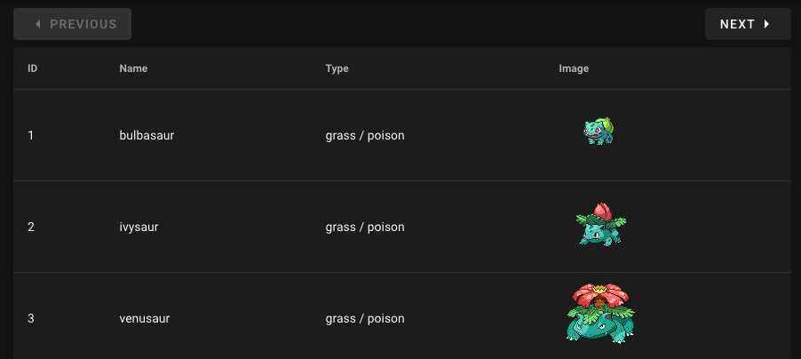

# zaiko-exercise-nuxt

## Build Setup
1. Install dependencies:
   ```
   npm i
   ```
2. Serve with hot reload:
   ```
   npm run dev
   ```
3. The nuxt project should now be running at http://localhost:3000/

## Exercise 1: API Integration


### Steps
1. At http://localhost:3000/exercise-1 a table with dummy data has been set up. We would like to fill this table in with data from the [The RESTful Pokémon API](https://pokeapi.co/docs/v2#pokemon).
2. The corresponding component for this can be found in `/pages/exercise-1/index.vue`. Use the Pokemon endpoint ([doc](https://pokeapi.co/docs/v2#pokemon), [example](https://pokeapi.co/api/v2/pokemon)) to load a page of 10 Pokemon into this component.
   1. Feel free to install & use whichever HTTP client library makes this easiest for you.
3. Additionally call the url in the payload for each Pokemon to get extended information for that Pokemon. Each table row should correspond to one Pokemon, and contain the following information:
   1. ID (`pokemon.id`)
   2. Name (`pokemon.name`)
   3. Types (`pokemon.types[].type.name`) -- note that a pokemon may have 1 or 2 types
   4. Image (`pokemon.sprites.front_default`)
   5. As each page load is making 10+ API calls, let's check that they are not blocking and are called in parallel
4. Please additionally implement pagination:
   1. The Previous button should be disabled when no previous page is available
   2. The Next button should be disabled when no next page is available
   3. Pressing Previous or Next should take the user to the previous or next page respectively

## References
- [Nuxt documentation](https://nuxtjs.org)
- [Vuetify documentation](https://vuetifyjs.com/en/)
